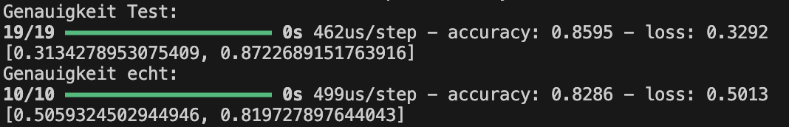

# Titanic Überlebensanalyse: Berechnung der Überlebenswahrscheinlichkeit einer Person

Dieses Repository enthält ein Machine-Learning-Projekt zur Vorhersage der Überlebenswahrscheinlichkeit von Passagieren der Titanic. Das zugrunde liegende Titanic-Dataset stammt von Kaggle und bietet Informationen über Passagiere wie Alter, Geschlecht, Ticketklasse und andere Merkmale. Mit diesen Daten wird ein neuronales Netzwerk trainiert, um Muster zu erkennen und vorherzusagen, ob ein Passagier überlebt hat oder nicht.

# Inhalt des Projekts

	1.	Datenvorbereitung:
	•	Die Daten werden aus dem Kaggle-Dataset extrahiert und in ein vorverarbeitetes Format (data_for_model.csv) umgewandelt.
	•	Zielvariable: Survived (1 = Überlebt, 0 = Nicht überlebt).
	•	Merkmale wie Geschlecht, Alter und Ticketklasse werden zur Modellierung verwendet.
	2.	Modellerstellung:
	•	Ein neuronales Netzwerk mit der Keras-Bibliothek wurde entwickelt.
	•	Architektur des Modells:
	•	Mehrere Dense-Layer mit Aktivierungsfunktionen wie relu und tanh.
	•	Dropout-Layer zur Reduktion von Overfitting.
	•	Sigmoid-Aktivierungsfunktion im Output-Layer für binäre Klassifikation (Überleben/Nicht-Überleben).
	3.	Modelltraining:
	•	Die Daten wurden in Trainings- und Testdaten unterteilt (33% Testdaten).
	•	Modelltraining über 110 Epochen mit einer Batch-Größe von 32.
	•	Optimierungsalgorithmus: Adam.
	•	Verlustfunktion: binary_crossentropy.
	4.	Evaluierung:
	•	Nach dem Training wird die Genauigkeit des Modells auf den Trainings- und Testdaten bewertet.
	•	Ziel: Ein Modell, das möglichst präzise die Überlebenswahrscheinlichkeit eines Passagiers vorhersagt.

# Modell Zusammenfassung: 

# Erreichte Genauigkeit:

Das aktuelle Modell erreicht eine durchschnittliche Genauigkeit von etwa 82%, was ein solides Ergebnis darstellt, jedoch Raum für Optimierungen bietet. Die Modellperformance kann durch gezielte Anpassungen in den folgenden Bereichen weiter verbessert werden:

	•	Anpassung der Batch-Größe: Eine sorgfältige Auswahl der Batch-Size kann die Konvergenzgeschwindigkeit und die Stabilität des 		Trainingsprozesses positiv beeinflussen. Kleinere Batches ermöglichen eine präzisere Gewichtsanpassung, während größere Batches für eine stabilere Gradientenberechnung sorgen.
	•	Optimierung der Netzwerkarchitektur: Eine Feinabstimmung der Anzahl und Größe der Layer (z. B. Hinzufügen von Neuronen oder Layern) sowie die Implementierung fortschrittlicher Aktivierungsfunktionen kann die Lernkapazität des Modells erhöhen.
	•	Anpassung der Trainingsepochen: Die Anzahl der Trainingsepochen sollte so gewählt werden, dass das Modell ausreichend lernt, ohne in Overfitting zu geraten. Eine systematische Evaluierung der Lernkurven kann dabei helfen, den optimalen Trainingszeitpunkt zu bestimmen.

Durch die Kombination dieser Strategien kann das Modell hinsichtlich Genauigkeit und Generalisierungsfähigkeit optimiert werden, um präzisere Vorhersagen zu ermöglichen.

!

   
