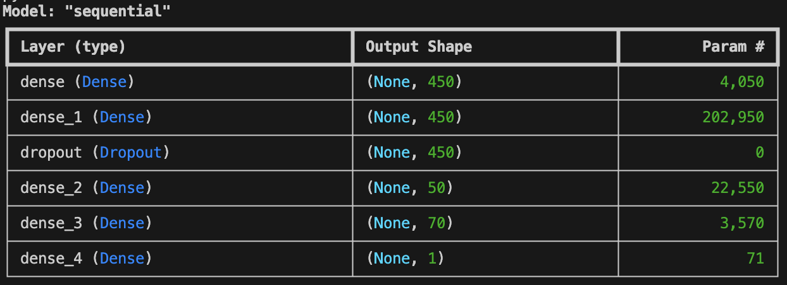

# Titanic Überlebensanalyse: Berechnung der Überlebenswahrscheinlichkeit einer Person

Dieses Repository enthält ein Machine-Learning-Projekt zur Vorhersage der Überlebenswahrscheinlichkeit von Passagieren der Titanic. Das zugrunde liegende Titanic-Dataset stammt von Kaggle und bietet Informationen über Passagiere wie Alter, Geschlecht, Ticketklasse und andere Merkmale. Mit diesen Daten wird ein neuronales Netzwerk trainiert, um Muster zu erkennen und vorherzusagen, ob ein Passagier überlebt hat oder nicht.

# Inhalt des Projekts

	1.	Datenvorbereitung:
	•	Die Daten werden aus dem Kaggle-Dataset extrahiert und in ein vorverarbeitetes Format (data_for_model.csv) umgewandelt.
	•	Zielvariable: Survived (1 = Überlebt, 0 = Nicht überlebt).
	•	Merkmale wie Geschlecht, Alter und Ticketklasse werden zur Modellierung verwendet.
	2.	Modellerstellung:
	•	Ein neuronales Netzwerk mit der Keras-Bibliothek wurde entwickelt.
	•	Architektur des Modells:
	•	Mehrere Dense-Layer mit Aktivierungsfunktionen wie relu und tanh.
	•	Dropout-Layer zur Reduktion von Overfitting.
	•	Sigmoid-Aktivierungsfunktion im Output-Layer für binäre Klassifikation (Überleben/Nicht-Überleben).
	3.	Modelltraining:
	•	Die Daten wurden in Trainings- und Testdaten unterteilt (33% Testdaten).
	•	Modelltraining über 110 Epochen mit einer Batch-Größe von 32.
	•	Optimierungsalgorithmus: Adam.
	•	Verlustfunktion: binary_crossentropy.
	4.	Evaluierung:
	•	Nach dem Training wird die Genauigkeit des Modells auf den Trainings- und Testdaten bewertet.
	•	Ziel: Ein Modell, das möglichst präzise die Überlebenswahrscheinlichkeit eines Passagiers vorhersagt.

# Modell Zusammenfassung: 

# Erreichte Genauigkeit:
Bei dem Stand des aktuellen Modells erreicht das Modell eine durchschnittliche Genaugikeit von c.a 82%. dieser Wert ist "gut" aber nicht perfekt. Er lässt sich durch folgende Faktoren verbessern: 

	Anpassung der Batch_Size
 	Anpassugn der Layer
  	Anpassung der Anzahl der Trainingsepochen

!

   
